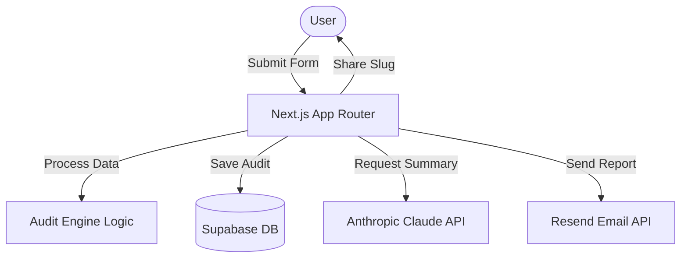

# Architecture

## System Diagram

## Data Flow
1. User enters team and tool data in a multi-step Framer Motion form.
2. Data is persisted to `localStorage` for session recovery.
3. On submission, the server runs the `AuditEngine` (pure TS logic) to identify savings.
4. Results are stored in Supabase with a unique `nanoid` slug.
5. The Results Page triggers an asynchronous call to the Anthropic API for a personalized financial summary.
6. Lead capture triggers a transactional email via Resend and saves contact info to Supabase.

## Stack Justification
- **Next.js**: Hybrid rendering (SSR for results, CSR for form).
- **Supabase**: Rapid schema development and built-in auth readiness.
- **Tailwind + shadcn**: Consistent, premium UI without custom CSS boilerplate.
- **Anthropic**: High-context financial reasoning for summaries.

## Scale Considerations
- **Rate Limiting**: Implemented at the API level to prevent abuse.
- **Database**: Supabase handles concurrent leads efficiently.
- **Edge Functions**: Used for OG image generation to ensure fast social previews.
